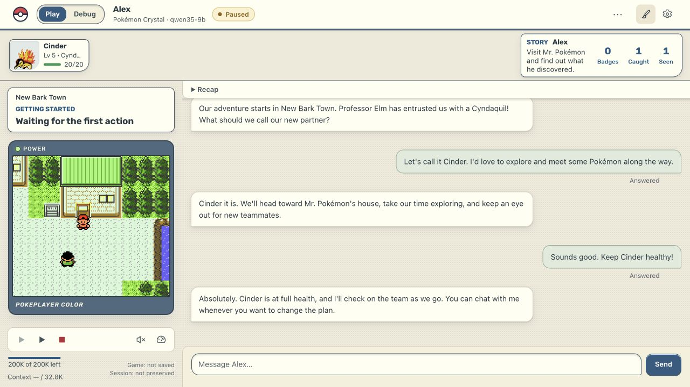
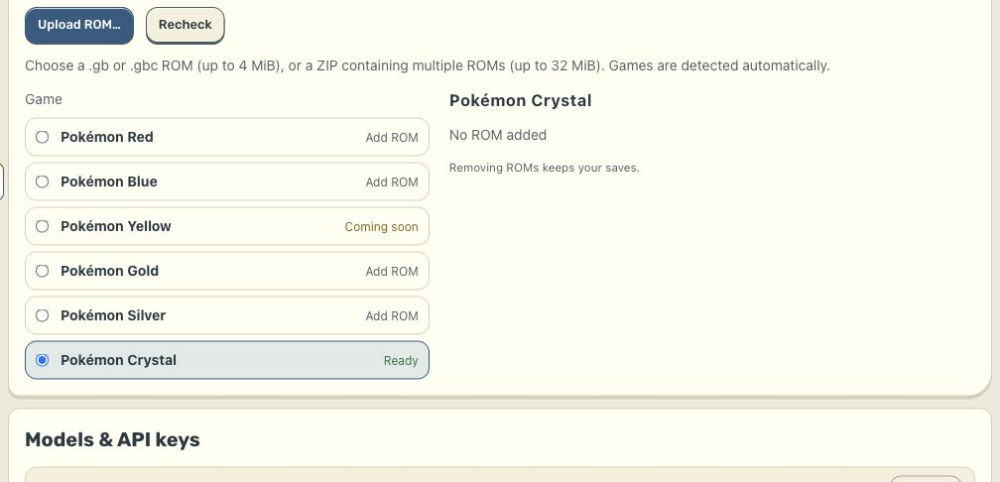
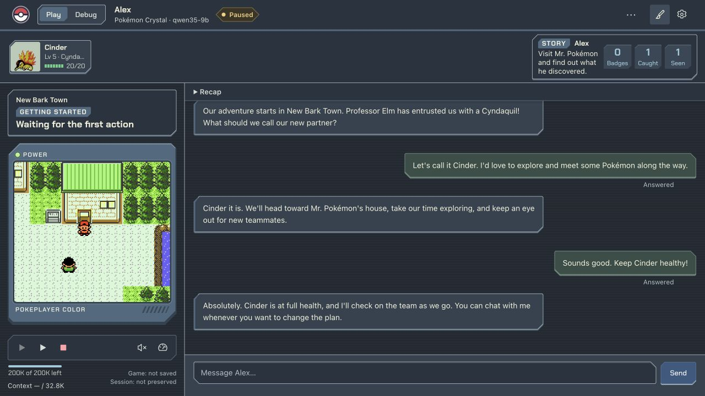

  

<h1 align="center">pokeplayer</h1>

<strong>A Pokémon adventure. An AI player. You along for the journey.</strong>

  <a href="https://github.com/stewberticus/pokeplayer-releases/releases/latest/download/pokeplayer-mac-arm64.dmg"><strong>Download for Mac</strong></a>
  · <a href="#quick-start">Get started</a>
  · <a href="#system-requirements">System requirements</a>
  · <a href="#choose-your-ai-provider">AI providers</a>

Apple Silicon · macOS 14 or later · signed and notarized by Apple

Play Pokémon together through conversation. The AI explores, battles, presses
the buttons, and keeps playing between your messages. Suggest a plan, name your
Pokémon together, ask what is happening, or simply watch the adventure unfold.
You never have to operate the game controls.

*The released interface with illustrative demo data and a recorded game frame.
The conversation is an example, not a gameplay benchmark.*

## What you can do

- **Share an adventure.** Play English Pokémon Red, Blue, Gold, Silver, or Crystal.
- **Talk while it plays.** Ask questions, offer ideas, and decide how involved you want to be.
- **Follow your team.** See the game, your party, and the conversation together.
- **Come back later.** Keep your adventures, saves, and conversations between sessions.
- **Choose your AI.** Run a model on your Mac or connect a supported cloud provider.
- **Make it yours.** Choose Handheld, Pokégear, or Cartridge styling, six colorways, and light or dark mode.

pokeplayer is an early **0.x release**. The goal is a full adventure through the
badges and Pokémon League; progress and reliability depend on the model, and
completing a game is not guaranteed.

## Download

| Platform | Package | Availability |
| --- | --- | --- |
| macOS · Apple Silicon (M1 or later) | [Mac disk image (`.dmg`)](https://github.com/stewberticus/pokeplayer-releases/releases/latest/download/pokeplayer-mac-arm64.dmg) | Available |
| macOS · Intel | — | No supported package |
| Windows / Linux | — | No package in the current public release |

The Mac app includes its runtime, emulator, game reference data, and local
inference engine. **No Python, Node.js, terminal setup, or separate model app is
needed for built-in local play.** Game ROMs and AI model weights are supplied
separately.

[Release notes](https://github.com/stewberticus/pokeplayer-releases/releases)
· [Mac first-game guide](https://github.com/stewberticus/pokeplayer-releases/releases/latest/download/MAC-START-HERE.md)
· [Download checksums](https://github.com/stewberticus/pokeplayer-releases/releases/latest/download/SHA256SUMS.txt)

## System requirements

### Mac application

| Requirement | What you need |
| --- | --- |
| Processor | Apple Silicon: M1 or later |
| Operating system | macOS 14 Sonoma or later |
| Memory | For built-in local AI, **8 GiB minimum** for the smallest model; **16 or 32 GiB** for the larger choices below. Cloud AI does not load the language model into your Mac's memory. |
| Storage | Space for the app, your game library, and any local models. The v0.2.2 installer download is about **186 MB**; installed size and library growth are additional. |
| Game | Your own supported English `.gb` or `.gbc` ROM. Crystal requires **version 1.1**. Yellow is not playable. |
| Internet | Required to download the app and local models, and for the first-launch notarization check. Cloud providers require it throughout play; built-in local play works offline after setup. |

There is no separately measured app-only RAM minimum for cloud play. The local
model limits below are the app's setup thresholds, not a claim that the whole
app uses that much memory.

### Built-in local models

Choose a model in **System Settings → Models & API keys → Built-in local model**.
The engine is included in the app; these model files download separately.

| Model | Minimum system memory | Model download | Free disk for a fresh model download¹ | Estimated model/runtime memory² |
| --- | ---: | ---: | ---: | ---: |
| **Qwen3.5 4B** | **8 GiB** | 2.74 GB | 3.82 GB | 5 GiB |
| **Qwen3.5 9B** | **16 GiB** | 5.68 GB | 6.76 GB | 10 GiB |
| **Qwen3.8 27B** | **32 GiB** | 18.97 GB | 20.05 GB | 25 GiB |

¹ Model file plus the setup check's 1 GiB disk reserve, rounded up. This is
additional to the installed app, existing models, and saves. GB is decimal;
GiB is binary memory capacity.

² Estimates for the packaged **Q4_K_M** models at **32,768 context tokens**.
Context is the amount of conversation and game information a model can process
at once. macOS and other apps need memory too; Apple Silicon shares memory
between the CPU and GPU, so do not add those capacities together.

**Use the recommendation shown on your own Mac.** Setup checks memory, free
disk, and available acceleration. These estimates are not measured peak-memory
limits or speed guarantees. CPU fallback can be slow, and a model that fits is
not necessarily a model that plays well. If setup cannot recommend a model,
choose a cloud provider or a smaller local model.

## Quick start

1. **Install.** Download the Mac disk image, drag **pokeplayer** into
   **Applications**, eject the disk image, and open the app.
2. **Add your game.** Open the settings gear, then **Games & ROMs**. Choose
   **Upload ROM…** and select your own ROM. The app
   checks the game release automatically.
3. **Choose your AI.** For local play, select **Built-in local model**, choose
   the model recommended for your Mac, and click **Download & test**. Wait until
   it is ready. For cloud play, follow the provider's setup below.
4. **Start an adventure.** Choose **Back to games → New game**, select your game
   and provider, and choose a model. For an external provider, use **Refresh
   models** and **Test connection** before starting.
5. **Say hello.** Try “Let's choose a starter together,” “How is our team
   doing?” or “Explore for a while—I'll watch.”

**Test connection sends a real model request.** Cloud tests can incur a charge
or use subscription quota. A successful test checks the connection and tool
support; it does not guarantee gameplay performance.

## Choose your AI provider

All five providers appear under **System Settings → Models & API keys**.

| Provider | Model runs on | What you supply | Internet while playing |
| --- | --- | --- | --- |
| [Built-in local](#built-in-local) | Your Mac | A model downloaded inside pokeplayer | No, after setup |
| [OpenRouter](#openrouter) | A cloud service | OpenRouter API key and access to a compatible model | Yes |
| [MiniMax](#minimax) | MiniMax's cloud | Token Plan Subscription Key and available quota | Yes |
| [LM Studio](#lm-studio) | Your Mac | LM Studio with a compatible local model and server running | No, once the local model is ready |
| [MTPLX](#mtplx) | Your Mac | MTPLX with a compatible model and server running | No, once the local model is ready |

Choose **Built-in local** for setup entirely inside pokeplayer. Choose a cloud
provider if you want to avoid a large model download or your Mac cannot fit a
local model. LM Studio and MTPLX are options for people who prefer managing their
own local model server.

### Built-in local

**Local AI managed by pokeplayer. No API key or separate model server.**

1. Open **System Settings → Models & API keys → Built-in local model**.
2. Pick a model using the [memory and storage table](#built-in-local-models)
   and your Mac's setup recommendation.
3. Click **Download & test**, and wait for the ready message.
4. In **New game**, select **Built-in local**.

The app starts the selected model for you on later launches. Interrupted
downloads can resume when the download server supports it. Models remain in
your app library across updates. Stop active games before changing the local
model; an existing adventure expects the model it was created with.

*Setup shown with a demo 16 GiB Mac profile. Your recommendation may differ.*

### OpenRouter

**Cloud models through one account; no large local model download.**

1. Create an [OpenRouter API key](https://openrouter.ai/settings/keys) and make
   sure your account has access or credit for the model you choose.
2. In **System Settings → Models & API keys → OpenRouter**, paste the key and
   choose **Save and check**.
3. In **New game**, select **OpenRouter**, then **Refresh models**. The app's
   cloud starter is **DeepSeek V4.1 Flash** (`deepseek/deepseek-v4.1-flash`).
4. Choose **Test connection**, then start your game.

Choose a model that supports both `tools` and `tool_choice`; these let the AI
operate the game. pokeplayer filters OpenRouter's catalog for that support.
Model availability and pricing can change—check the provider's current
[model catalog](https://openrouter.ai/models) and
[tool-calling guide](https://openrouter.ai/docs/guides/features/tool-calling).
Usage is billed through your OpenRouter account, including requests made while
the AI plays between your messages.

### MiniMax

**Direct MiniMax access using your Token Plan subscription.**

1. Get your **Token Plan Subscription Key** from the
   [MiniMax platform](https://platform.minimax.io/subscribe/token-plan).
2. In **System Settings → Models & API keys → MiniMax**, paste that key and
   choose **Save and check**.
3. In **New game**, select **MiniMax**, refresh the models, and choose a model
   available to your subscription, such as `MiniMax-M3` or `MiniMax-M2.7`.
4. Choose **Test connection**, then start your game.

This integration is designed for the **Token Plan Subscription Key**. Use the
models returned for your key; access, quota, and rate limits depend on your
plan. The model runs in the cloud, so no Qwen download or local inference GPU
is needed.

### LM Studio

**Use a local model you manage in LM Studio.**

1. Install [LM Studio](https://lmstudio.ai/) and download a local GGUF or MLX
   chat model with tool support. The app's local starter is **Qwen3.8 27B
   (4-bit)**; your Mac needs enough memory for that model and its context.
2. Load the model with **at least 32,768 context tokens**, then start the server
   in LM Studio's **Developer** tab. See the
   [local-server guide](https://lmstudio.ai/docs/developer/core/server).
3. In **System Settings → Models & API keys → LM Studio**, check the server
   address. The default is `http://127.0.0.1:1234`. If you enabled server
   authentication, save its API token here too.
4. In **New game**, choose **LM Studio → Refresh models**, select the loaded
   model, and use **Test connection**.

Keep LM Studio's server running during play. Its model format, quantization,
and loaded context determine memory use; the built-in model table is not a
universal minimum for LM Studio models. pokeplayer connects to a server on the
same Mac through a loopback address.

### MTPLX

**Connect a local model served by MTPLX on Apple Silicon.**

1. Install [MTPLX](https://mtplx.com/) and start a model with native tool support.
2. Configure **at least 32,768 usable context tokens**. Allow enough memory for
   both the model and that context.
3. In **System Settings → Models & API keys → MTPLX**, check the server address
   (default: `http://127.0.0.1:8000`). Save the server's API key if authentication
   is enabled.
4. In **New game**, choose **MTPLX → Refresh models**, select the model reported
   by the server, and use **Test connection**.

Keep the server running on the same Mac. pokeplayer uses the model already
served by MTPLX and reads its usable context window. **The integration is
implemented, but end-to-end gameplay compatibility has not yet been verified.**

### Model compatibility and privacy

External models need native tool calling and at least **32,768 context tokens**.
If you increase the output allowance, leave at least **8,192 context tokens**
beyond it. Use **Test connection** again after changing the model or its settings.

With built-in local AI, model inference stays on your Mac. With cloud providers,
your conversation and the game information needed for decisions are sent to the
chosen provider. The AI reads structured game information; game screenshots are
for you and are not sent to the model. Desktop provider keys use the operating
system's encrypted storage.

## Save, resume, and personalize

- **Stop now** preserves the session. **Save and quit** asks the player to make
  an in-game save first. Wait for preservation to finish before closing.
- **Continue** reopens an existing adventure with its game state and conversation.
  **Load in-game save** returns to that earlier save and its matching conversation.
- **Game → Open game library** opens your local saves and conversations.
  They live separately from the app under `~/Library/Application Support/pokeplayer`
  and survive app updates.
- Use the **paintbrush / Theme** control to change the style, colorway, or light
  and dark appearance.

<strong>See the Pokégear style in dark mode</strong>

*Illustrative demo data in the released interface.*

## Need a hand?

| Problem | Try this |
| --- | --- |
| macOS prevents the app from opening | Confirm you downloaded the official disk image and compare it with the release's checksum. Then follow [Apple's instructions for opening a trusted app](https://support.apple.com/en-us/102445). |
| My game is not recognized | Use a supported English release. Crystal must be 1.1; Yellow is not playable. The app checks the ROM contents, not just its filename. |
| No local model fits, or play is very slow | Check the model recommendation, close memory-heavy apps, choose a smaller model, or use OpenRouter / MiniMax. |
| The local server cannot be reached | Start LM Studio or MTPLX, load a tool-capable model, check the loopback address and optional key, then refresh models. |
| Connection test fails | Check the key, cloud credit/quota, tool support, and loaded context size. **Save and check** verifies the provider; **Test connection** checks the selected model. |
| A model download was interrupted | Retry from System Settings. Downloaded partial data is retained and resumed when supported. |

For a problem report, [open an issue](https://github.com/stewberticus/pokeplayer-releases/issues)
with the app version, macOS version, Mac chip and memory, provider/model, the
step that failed, and the exact error. Include a screenshot if helpful. Do not
post API keys, ROM files, or private conversation exports.

## About this repository

This repository hosts the public downloads and user guide; the application
source is private. See [release notes](https://github.com/stewberticus/pokeplayer-releases/releases)
for changes in each version. This guide and its screenshots describe **v0.2.2**.

No games are included or downloaded by pokeplayer; supply your own ROMs.
Pokémon is a trademark of Nintendo, Game Freak, and Creatures. pokeplayer is an
independent project and is not affiliated with them.
